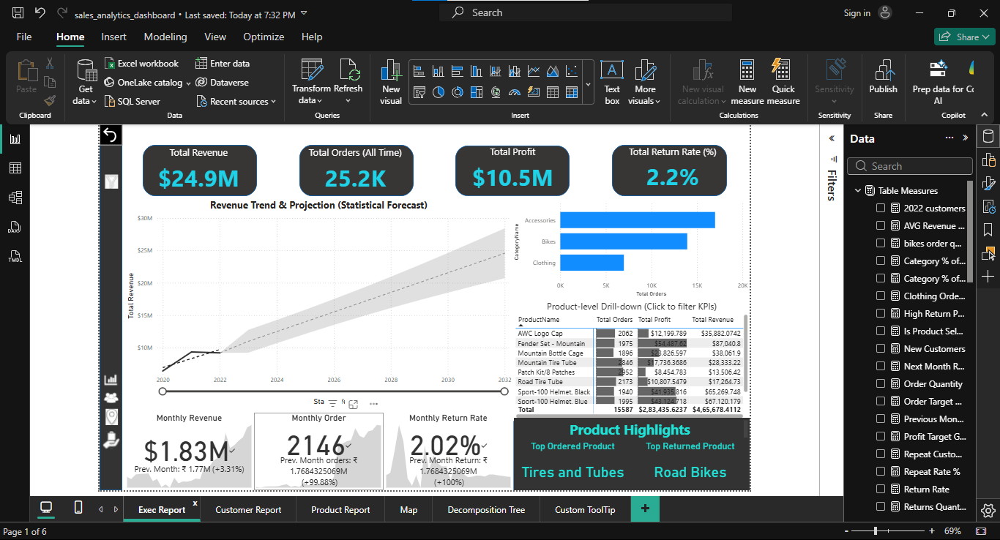
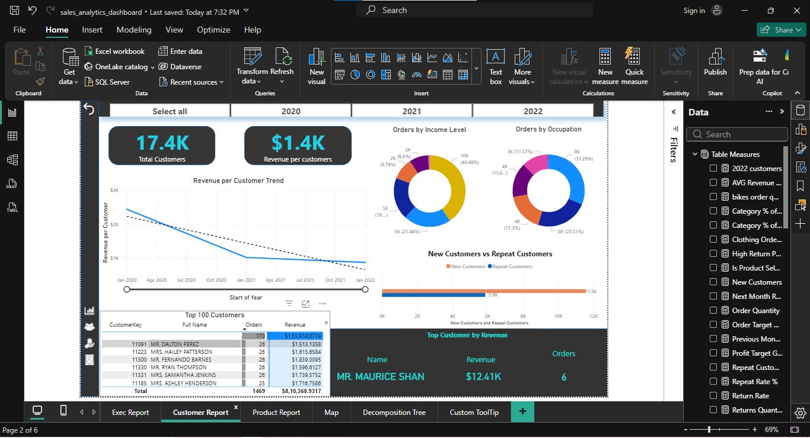
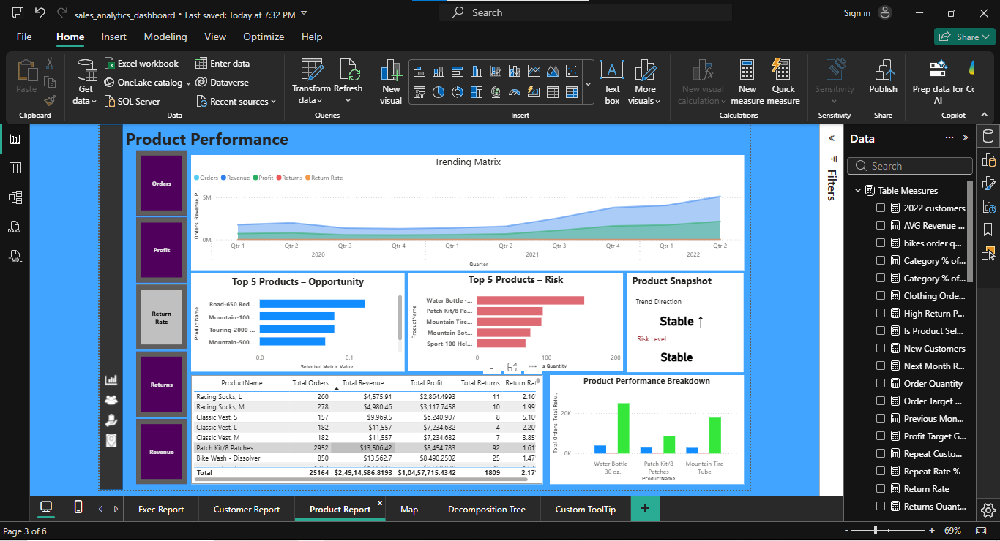

# SQL & Power BI Sales Analytics Project (2020–2022)

## Overview
This project demonstrates an end-to-end analytics workflow using SQL and Power BI.
Sales data from 2020, 2021, and 2022 was combined and analyzed to understand
business performance across time, products, customers, returns, and regions.

The focus of this project is not just visualization, but validating insights
through SQL before building dashboards.

---

## Business Problem
The business wanted a clear view of:
- How revenue and sales volume changed over time
- Which products and categories drive the most revenue
- How customer segments contribute to overall sales
- Which regions perform best
- How product returns impact performance

---

## Data Model
The analysis is based on a star-schema style model:
- **Fact Table:** Sales Data (merged for 2020–2022)
- **Dimensions:** Calendar, Product, Product Category, Customer, Territory
- **Additional Table:** Returns Data for return analysis

Raw datasets are not shared publicly due to data sensitivity.

---

## SQL Analysis
SQL was used to validate trends and understand distributions before finalizing
Power BI dashboards. The analysis includes:
- Yearly and monthly revenue trends
- Product and category performance
- Customer segmentation by income level
- Returns vs sales analysis
- Regional revenue ranking

All SQL queries are available in the `sql/` folder.

---

## Power BI Dashboard
Power BI was used to translate analytical findings into interactive dashboards.
The report includes:
- Executive-level KPIs
- Time-based revenue trends
- Product and customer deep dives
- Regional performance insights

Dashboard screenshots are available in the `screenshots/` folder.

### Executive Overview

### Customer Analysis

### Product Performance

---

## Key Outcome
This project reflects how SQL and Power BI are used together in real-world
analytics work — SQL for validation and depth, Power BI for storytelling
and decision support.
